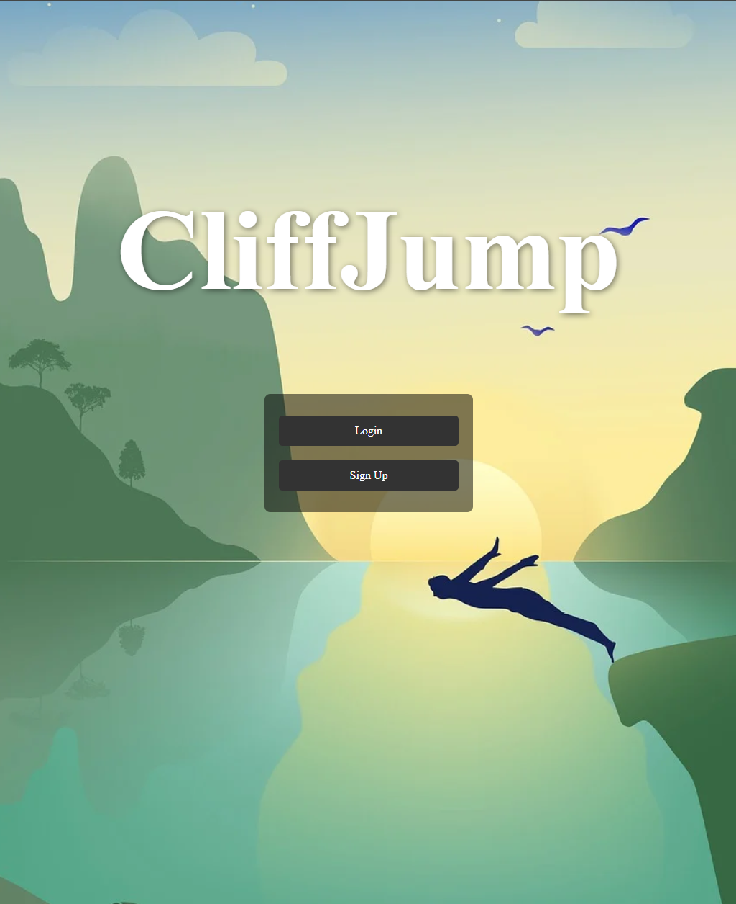

# CliffJump

## Description
Cliff Jumping Saltus is a full-stack web application designed for adventure enthusiasts to discover and share cliff jumping spots. Users can create profiles, add new jumping locations, browse existing spots, and mark locations as safe or unsafe for jumping. This platform aims to build a community of cliff jumpers who can share their experiences and help others find safe and exciting locations.

I built this application to combine my passion for outdoor adventures with web development, creating a centralized resource for cliff jumping enthusiasts that prioritizes safety and community knowledge sharing.

## ✨ Features
- User authentication (signup, login, logout)
- Create, read, update, and delete cliff jumping spots
- Safety indicator for each location
- User profile page to manage your spots
- Default image fallback for spots without photos

## 🚀 Getting Started
- [Deployed App](https://cliffjump-location-app-dc679bf30212.herokuapp.com/)
- [Planning Materials](https://trello.com/b/lH952rST/project-2) 

## 🛠️ Technologies Used
- **Frontend**: HTML, CSS, EJS templates
- **Backend**: Node.js, Express.js
- **Database**: MongoDB with Mongoose ODM
- **Authentication**: Express sessions
- **Deployment**: Heroku
- **Other**: JavaScript, Git, npm

## 🙏 Attributions
- Default "no image" placeholder from [FREEP!K](https://www.freepik.com/)
- Stylesheets inspired by [W3Schools](https://www.w3schools.com/css/css_form.asp)

## 🔮 Next Steps
- Add geolocation support with interactive maps
- Implement social features (comments, likes, ratings)
- Create a mobile app version 
- Add weather API integration to show current conditions at jumping spots
- Incorporate user verification for trusted safety ratings
- Develop a filtering system for spots based on difficulty level or state

## 📫 Contact
Created by Derrik Youmans - feel free to reach out with any questions!